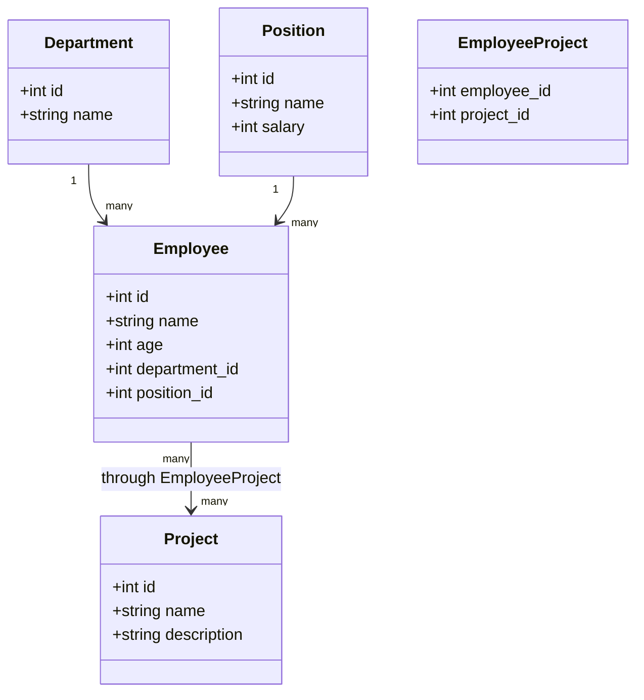

# UML Class Diagram

```mermaid
classDiagram
    class Department {
        +int id
        +string name
    }

    class Position {
        +int id
        +string name
        +int salary
    }

    class Project {
        +int id
        +string name
        +string description
    }

    class Employee {
        +int id
        +string name
        +int age
        +int department_id
        +int position_id
    }

    class EmployeeProject {
        +int employee_id
        +int project_id
    }

    Department "1" --> "many" Employee
    Position "1" --> "many" Employee
    Employee "many" --> "many" Project : through EmployeeProject
```
